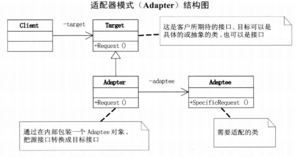

## 模式介绍

适配器模式：将一个类的接口转换成客户希望的另外一个接口。Adapter模式使得原本由于接口不兼容而不能一起工作的类可以一起工作。

例如：

NBA中的球员来自不同国家，而世界标准语言是英语。那他们不会英语，也不能各自学习所有国家的语言。所以，最好的办法就是请不同的翻译

将这些球员国家的语言翻译成英语。**而这些翻译就是适配器**

适配器模式分类：

1. 类适配器模式（不推荐使用）：由于类适配器模式需要多重继承对一个接口对另一个接口进行适配，而C#,Java不支持多重继承。

2. 对象适配器模式：采用组合的方式

## 实例代码

### 类适配器

```java
/**
 * 需要被适配的类（各个球员）
 */
public class Adaptee {
    public void request() {
        System.out.println("请求通过");
    }
}

/**
 * 适配器接口：翻译的一个接口
 */
public interface Target {
    void handleReq();
}

/**
 * 具体的适配器的实现（相当于各国的翻译）
 */
public class Adapter extends Adaptee implements Target {
    //这里需要和被适配对象关联起来：1.继承   2.组合(推荐)
    private Adaptee adaptee;

    @Override
    public void handleReq() {
        super.request();
    }
}

/**
 * 测试对象适配器模式
 */
public class Client {
    //说话
    public void test1(Target t) {
        t.handleReq();
    }

    public static void main(String[] args) {
        Client c = new Client();
        Adaptee a = new Adaptee();
        Target t = new Adapter();
        c.test1(t);
    }
}
```

结果是控制台打印：请求通过

### 对象适配器

由于类适配器中只能继承一个被需要适配的对象，则不推荐使用。

要使用对象适配器，只需要使用组合即可。修改适配器实现代码

```java
/**
 * 需要被适配的类（各个球员）
 */
public class Adaptee {
    public void request() {
        System.out.println("请求通过");
    }
}

/**
 * 适配器接口：翻译的一个接口
 */
public interface Target {
    void handleReq();
}

/**
 * 具体的适配器的实现（相当于各国的翻译）
 */
public class Adapter implements Target {
    //这里需要和被适配对象关联起来：1.继承   2.组合(推荐)
    private Adaptee adaptee;//这里使用组合

    @Override
    public void handleReq() {
        adaptee.request();
    }

    public Adapter(Adaptee adaptee) {//在构造器中构造被适配的对象
        super();
        this.adaptee = adaptee;
    }
}

/**
 * 测试对象适配器模式
 */
public class Client {
    //说话
    public void test1(Target t) {
        t.handleReq();
    }

    public static void main(String[] args) {
        Client c = new Client();
        Adaptee a = new Adaptee();
        Target t = new Adapter(a);//需要传入适配器
        c.test1(t);
    }
}
```

## 总结

### 常见应用场景

- java.io.InputStreamReader(InputStream)
- java.io.OutputStreamWriter(OutputStream)

