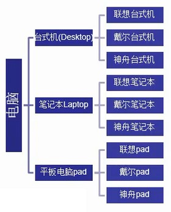
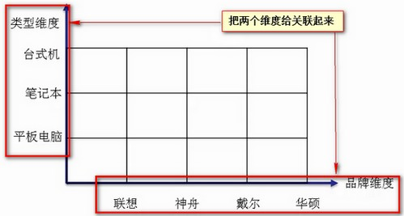
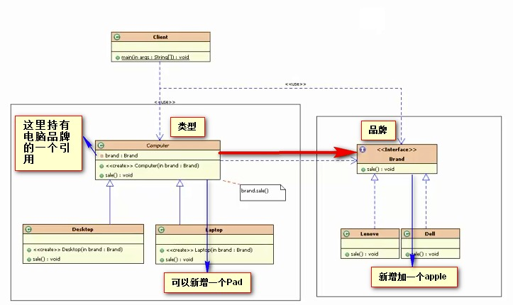

## 模式介绍

桥接模式：将抽象部分与它的实现部分分离，使它们都可以独立的变化。而不会直接影响到其他部分。

未使用桥接模式的抽象与实现结构图（如下）：



如果要增加一个apple品牌的电脑，则需要在台式机下新增一个apple的台式机

在笔记本下新增一个apple笔记本，在pad下新增一个apple的pad。代码比较繁琐。

如果使用桥接模式（如下图），使抽象部分和抽象的派生（实现）部分分离出来，这样让它们各自的变化，这样每种实现就不会影响到其他实现。从而达到对应变化的目的

将电脑类型作为一个维度，将品牌也做为一个维度。两个维度独立起来，可以任意的变化。



桥接模式解决了多层继承的结构，处理多维度变化的场景，将各个维度设计成独立的继承结构。使各个维度可以独立的扩展在抽象层建立联系。

最终类图如下：



## 实例代码

首先定义一个品牌维度的接口（Brand）

```java
package com.fz.bridge;

/**
 * 品牌维度：联想，戴尔，华硕....
 */
public interface Brand {
    void sale();//销售电脑
}

class Lenovo implements Brand {
    @Override
    public void sale() {
        System.out.println("联想");
    }
}

class Dell implements Brand {
    @Override
    public void sale() {
        System.out.println("戴尔");
    }
}
```

再定义一个电脑类型的类，为什么用类不用接口呢？因为这个类里还有持有品牌维度的引用

```java
package com.fz.bridge;

/**
 * 电脑类型维度：这里需要使用一个类，不能用接口。因为这里还需要持有品牌（Brand）的一个引用
 */
public class Computer {
    private Brand brand;//类型维度里持有品牌维度的引用

    public void sale() {
        brand.sale();//具体某品牌的销售
    }

    public Computer(Brand brand) {
        super();
        this.brand = brand;
    }
}

class Desktop extends Computer {
    public Desktop(Brand brand) {
        super(brand);
    }

    @Override
    public void sale() {
        super.sale();
        System.out.println("台式机");
    }
}

class Laptop extends Computer {
    public Laptop(Brand brand) {
        super(brand);
    }

    @Override
    public void sale() {
        super.sale();
        System.out.println("笔记本");
    }
}
```

测试销售

```java
public static void main(String[]args){
        //销售联想的笔记本
        Computer c=new Laptop(new Lenovo());
        c.sale();
        }
```

控制台结果：

```text
联想
笔记本
```

在这里，如果想增加一个电脑类型（Pad）或者想增加一个品牌（apple），都很简单。只需继承类型维度（Computer）或者实现维度接口（Brand）即可。

变化某一个维度，则不会影响到其他实现。

## 总结

### 常见应用场景

- JDBC驱动程序
- AWT中的Pear架构
- 银行日志管理：
    - 格式分类：操作日志，交易日志，异常日志
    - 距离分类：本地记录日志，异地记录日志
- 人力资源系统中的奖金计算模块：
    - 奖金分类：个人奖金，团体奖金，项目奖金，激励奖金
    - 部门分类：人事部，销售部，研发部
- OA系统中的消息处理：
    - 业务类型：普通消息，加急消息，特急消息
    - 发送消息方式：系统内消息，手机短信，邮件
