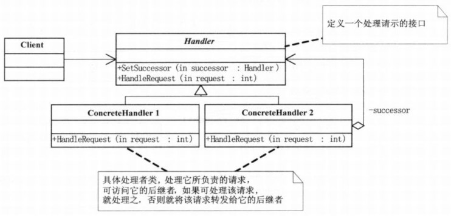

## 模式介绍

责任链模式：将能够处理同一类请求的对象连成一条链，使这些对象都有机会处理请求，所提交的请求沿着链传递。从而避免请求的

发送者和接受者之间的耦合关系。链上的对象逐个判断是否有能力处理该请求，如果能则就处理，如果不能，则传给链上的下一个对象。

直到有一个对象处理它为止。

场景：

1. 打牌时，轮流出牌
2. 接力赛跑
3. 请假审批
4. 公文审批

责任链UML图：


**Handler**：表示处理请求的接口，在这个接口里可以定义链上的下一个继承者，和一个处理请求的抽象方法。

**ConcreteHandler1和ConcreteHandler2**：表示具体的处理者

## 实例代码

这里以请假的流程为例，用责任链模式来实现

首先这里定义一个请假信息的对象

```java
/**
 * 请假的基本信息
 */
public class LeaveRequest {
    private String empName;//请假人
    private int leaveDays;//请假天数
    private String reason;//请假理由   

    public LeaveRequest(String empName, int leaveDays, String reason) {
        super();
        this.empName = empName;
        this.leaveDays = leaveDays;
        this.reason = reason;
    }

    public String getEmpName() {
        return empName;
    }

    public void setEmpName(String empName) {
        this.empName = empName;
    }

    public int getLeaveDays() {
        return leaveDays;
    }

    public void setLeaveDays(int leaveDays) {
        this.leaveDays = leaveDays;
    }

    public String getReason() {
        return reason;
    }

    public void setReason(String reason) {
        this.reason = reason;
    }
}
```

然后定义一个抽象类，来处理各个请求之间的关系。也就是UML图中的Handler部分

```java
/**
 * 抽象类：管理责任链上的对象处理的抽象类
 */
public abstract class Leader {
    protected String name;
    protected Leader nextLeader;//下一个继承者

    public Leader(String name) {
        super();
        this.name = name;
    }

    //设置责任链上的下一个继承者
    public void setNextLeader(Leader nextLeader) {
        this.nextLeader = nextLeader;
    }

    //处理请求的抽象方法
    public abstract void handleRequest(LeaveRequest leader);
}
```

接下来就可以开始定义处理请求的具体对象了，比如处理请假信息的：主任，经理，总经理等等。这些对象都必须继承抽象类，来处理请求。

主任对象：处理小于等于3天的假期

```java
//主任
public class Director extends Leader {
    public Director(String name) {
        super(name);
    }

    /**
     * 责任链上对象对请求的具体处理
     */
    @Override
    public void handleRequest(LeaveRequest leader) {
        if (leader.getLeaveDays() <= 3) {
            System.out.println("请假人：" + leader.getEmpName() + ",天数：" + leader.getLeaveDays() + ",理由：" + leader.getReason());
            System.out.println("审批人：" + this.name + " 主任，审批通过！");
        } else {
            if (this.nextLeader != null) {//如果有下一个继承者
                //让下一个继承者处理请求
                this.nextLeader.handleRequest(leader);
            }
        }
    }
}
```

经理对象：处理大于3天，小于等于10天的假期

```java
//经理
public class Manager extends Leader {
    public Manager(String name) {
        super(name);
    }

    /**
     * 责任链上对象对请求的具体处理
     */
    @Override
    public void handleRequest(LeaveRequest leader) {
        if (leader.getLeaveDays() <= 10) {
            System.out.println("请假人：" + leader.getEmpName() + ",天数：" + leader.getLeaveDays() + ",理由：" + leader.getReason());
            System.out.println("审批人：" + this.name + " 经理，审批通过！");
        } else {
            if (this.nextLeader != null) {//如果有下一个继承者
                //让下一个继承者处理请求
                this.nextLeader.handleRequest(leader);
            }
        }
    }
}
```

总经理对象：处理大于等于10天，小于30天的请假信息

```java
//总经理
public class GeneralManager extends Leader {
    public GeneralManager(String name) {
        super(name);
    }

    /**
     * 责任链上对象对请求的具体处理
     */
    @Override
    public void handleRequest(LeaveRequest leader) {
        if (leader.getLeaveDays() <= 30) {
            System.out.println("请假人：" + leader.getEmpName() + ",天数：" + leader.getLeaveDays() + ",理由：" + leader.getReason());
            System.out.println("审批人：" + this.name + " 总经理，审批通过！");
        } else {
//          if (this.nextLeader != null ) {//如果有下一个继承者
//              //让下一个继承者处理请求
//              this.nextLeader.handleRequest(leader);
//          }
            //总经理上面没人了，所以不往下发送请求。
            System.out.println("请假申请，最终不通过！最终审批人：" + this.name + "  总经理");
        }
    }
}
```

重要代码都写完了，下面开始测试：

```java
public static void main(String[]args){
    //构建各个领导人
    Leader a=new Director("张三");//主任
    Leader b=new Manager("李四");//经理
    Leader c=new GeneralManager("王五");//总经理
    //设置各个责任链上的关系
    a.setNextLeader(b);//主任的下一个审批人为经理
    b.setNextLeader(c);//经理的下一个审批人为总经理
    
    //开始请假
    LeaveRequest request=new LeaveRequest("小明",3,"旅游");
    a.handleRequest(request);//小明提交了请假申请给主任
}
```

控制台则打印：主任审批

```text
请假人：小明,天数：3,理由：旅游
审批人：张三 主任，审批通过！
```

如果改成13天：则就是总经理审批

```text
请假人：小明,天数：13,理由：旅游
审批人：王五 总经理，审批通过！
```

此时，我们发现，责任链上漏掉了副总经理，那也很好办。直接加上副总经理就行了

增加一个副总经理的对象

```java
package com.fz.chainOfResponsibility;

/**
 * 副总经理
 */
public class ViceGeneralManager extends Leader {
    public ViceGeneralManager(String name) {
        super(name);
    }

    /**
     * 责任链上对象对请求的具体处理
     */
    @Override
    public void handleRequest(LeaveRequest leader) {
        if (leader.getLeaveDays() <= 20) {
            System.out.println("请假人：" + leader.getEmpName() + ",天数：" + leader.getLeaveDays() + ",理由：" + leader.getReason());
            System.out.println("审批人：" + this.name + " 副总经理，审批通过！");
        } else {
            if (this.nextLeader != null) {//如果有下一个继承者
                //让下一个继承者处理请求
                this.nextLeader.handleRequest(leader);
            }
        }
    }
}
```

测试的代码呢，构造副总经理对象。然后再设置继承者的关系

```java
public static void main(String[]args){
    //构建各个领导人
    Leader a=new Director("张三");//主任
    Leader b=new Manager("李四");//经理
    //增加副总经理
    Leader b2=new ViceGeneralManager("赵四");//副总经理
    Leader c=new GeneralManager("王五");//总经理
    //设置各个责任链上的关系
    a.setNextLeader(b);//主任的下一个审批人为经理
    b.setNextLeader(b2);//经理的下一个审批人为副总经理
    b2.setNextLeader(c);//副总经理的下一个审批人为总经理
    //开始请假
    LeaveRequest request=new LeaveRequest("小明",19,"旅游");
    a.handleRequest(request);//小明提交了请假申请给主任
}
```

测试结果就是：副总经理审批

```text
请假人：小明,天数：19,理由：旅游
审批人：赵四 副总经理，审批通过！
```

## 总结

### 实现方式

1. 链表方式：比如刚才的请假审批
2. 非链表方式：通过集合，数组生成责任链更加实用，将链表上的各个对象都添加到集合中，然后通过反射给构建出来。然后在容器里一个个的处理。（也就是说把测试代码中除了请假的其他代码都给用一个类来处理）

### 常见应用场景

1. Java的异常机制就是一个责任链模式，一个try可以对应多个cathc。如果某一个catch不匹配，则跳到下一个catch中

2. JavaScript语言中的事件的冒泡和捕获机制

3. Servlet开发中，过滤器的链式处理

4. Struts2中，拦截器的调用也是典型的责任链模式

### 责任链的好处

1. 接受者和发送者都没有对方的明确信息，且链中的对象也并不知道链的结构，结果是责任链可简化对象的相互连接，它们仅需保持一个指向其后继者的引用，而不需要保持它所有的候选继承者，大大的降低了耦合度。请求者不用管具体哪个对象会处理，反正该请求肯定会被处理就行了
2. 可以随时增加或者修改处理一个请求的结构，增加了给对象指派职责的灵活性
