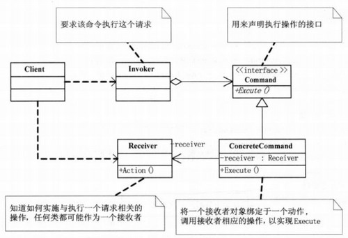
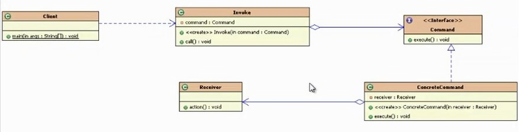

## 模式介绍

命令模式：将一个请求封装为一个对象，从而使你可用不同的请求对客户进行参数化，对请求排队或记录请求日志。以及支持可撤销的操作。

说白了，就是将一系列的请求命令封装起来，不直接调用真正执行者的方法，这样比较好扩展。

命令模式UML图：


**Command（抽象命令类）**：抽象出命令对象，可以根据不同的命令类型。写出不同的实现类

**ConcreteCommand（具体命令类）**：实现了抽象命令对象的具体实现

**Invoker（调用者/请求者）**：请求的发送者，它通过命令对象来执行请求。一个调用者并不需要在设计时确定其接收者，因此它只与抽象命令来之间存在关联。在程序运行时，将调用命令对象的execute() ，间接调用接收者的相关操作。

**Receiver（接收者）**：接收者执行与请求相关的操作，真正执行命令的对象。具体实现对请求的业务处理。未抽象前，实际执行操作内容的对象。

**Client（客户端）**：在客户类中需要创建调用者对象，具体命令类对象，在创建具体命令对象时指定对应的接收者。发送者和接收者之间没有之间关系。都通过命令对象来调用。

## 实例代码

首先定义一个命令的接收者，也就是到最后真正执行命令的那个人

```java
//接收者：真正执行命令的对象
public class Receiver {
    public void action() {
        System.out.println("命令执行了.......");
    }
}
```

然后定义抽象命令和抽象命令的具体实现，具体命令类中需要持有真正执行命令的那个对象。

```java
//抽象命令类：抽象的命令，可以根据不同类型的命令写出不同的实现
public interface Command {
    //调用命令
    void execute();
}

//具体命令类
class ConcreteCommand implements Command {
    private Receiver receiver;//持有真正执行命令对象的引用

    public ConcreteCommand(Receiver receiver) {
        super();
        this.receiver = receiver;
    }

    @Override
    public void execute() {
        //调用接收者执行命令的方法
        receiver.action();
    }
}
```

接下来就可以定义命令的发起者了，发起者需要持有一个命令对象。以便来发起命令。

```java
//请求者/调用者：发起执行命令请求的对象
public class Invoker {
    private Command command;//持有命令对象的引用

    public Invoker(Command command) {
        super();
        this.command = command;
    }

    public void call() {
        //请求者调用命令对象执行命令的那个execute方法
        command.execute();
    }
}
```

客户端测试：客户端

```java
public static void main(String[]args){
        //通过请求者（invoker）调用命令对象（command），命令对象中调用了命令具体执行者（Receiver）
        Command command=new ConcreteCommand(new Receiver());
        Invoker invoker=new Invoker(command);
        invoker.call();
        }
```

结果打印：命令执行了.......

代码的UML图如下：


## 总结

### 常见应用场景

- Struts2中action中的调用过程中存在命令模式
- 数据库中的事务机制的底层实现
- 命令的撤销和恢复：增加相应的撤销和恢复命令的方法（比如数据库中的事务回滚）
