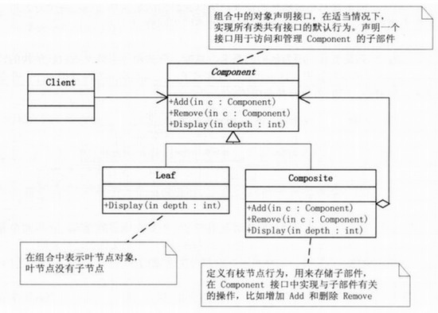
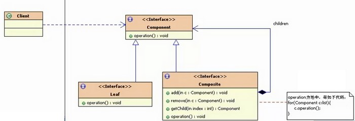

## 模式介绍

组合模式：将对象组合成树形结构以表示：部分--整体 的层次结构。组合模式使得用户对单个对象和组合对象的使用具有一致性。

java中的组合是指：在A类里定义一个B类的引用，A拥有了B，叫组合。只是单纯的组合而已，而不是一种设计模式。

组合和组合模式不是一回事！

基本上见到的树形结构都使用到了组合模式。

组合模式结构图：



组合模式中有几个核心的部分：

Leaf（叶子）：表示该节点下面没有其他子节点了，就称为叶子

Compostie（容器构件）：容器构件，该节点下还有其他子节点，理解为一个容器，里面包含了其他子节点。就叫做容器构件

Component（抽象构件）：抽象构件中定义了叶子和容器构件的共同点。比如，有公共的添加删除叶子功能，有显示节点功能。

例如：Windows中的文件管理



## 实例代码

首先，定义一个抽象的Component。提供一系列的公共接口

```java
//Component（抽象构件）：抽象构件中定义了叶子和容器构件的共同点。比如，有公共的添加删除叶子功能，有显示节点功能。
public abstract class Component {
    protected String name;

    public Component(String name) {
        super();
        this.name = name;
    }

    public abstract void add(Component c);

    public abstract void remove(Component c);

    public abstract void display(int depth);
}
```

然后定义具体的叶子节点，和容器节点

定义叶子节点，由于叶子节点中没有子节点了，所以不需要add和remove的具体实现

```java
//表示该节点下面没有其他子节点了，就称为叶子
public class Leaf extends Component {
    public Leaf(String name) {
        super(name);
    }

    @Override
    public void add(Component c) {
        System.out.println("leaf no add");
    }

    @Override
    public void remove(Component c) {
        System.out.println("leaf no remove");
    }

    @Override
    public void display(int depth) {
        StringBuffer sb = new StringBuffer("-");
        for (int i = 0; i <= depth; i++) {
            sb.append("-");
        }
        System.out.println(sb.toString() + name);
    }
}
```

再定义一个容器节点

```java
import java.util.ArrayList;
import java.util.List;

//容器构件，该节点下还有其他子节点，理解为一个容器，里面包含了其他子节点。就叫做容器构件
public class Composite extends Component {
    private List<Component> children = new ArrayList<Component>();

    public Composite(String name) {
        super(name);
    }

    @Override
    public void add(Component c) {
        children.add(c);
    }

    @Override
    public void remove(Component c) {
        children.remove(c);
    }

    @Override
    public void display(int depth) {
        StringBuffer sb = new StringBuffer("-");
        for (int i = 0; i <= depth; i++) {
            sb.append("-");
        }
        System.out.println(sb.toString() + name);
        for (Component com : children) {
            com.display(depth + 2);
        }
    }
}
```

最后客户端测试代码：添加一个树形结构

```java
public static void main(String[]args){
    Composite root=new Composite("root");
    root.add(new Leaf("Leaf A"));
    root.add(new Leaf("Leaf B"));
    
    Composite comp=new Composite("Composite X");
    comp.add(new Leaf("Leaf XA"));
    comp.add(new Leaf("Leaf XB"));
    root.add(comp);
    
    Composite comp2=new Composite("Composite XY");
    comp2.add(new Leaf("Leaf XYA"));
    comp2.add(new Leaf("Leaf XYB"));
    comp.add(comp2);
    
    root.add(new Leaf("Leaf C"));
    Leaf leaf=new Leaf("Leaf D");
    root.add(leaf);
    //  root.remove(leaf);//这里可以删除某节点
    root.display(1);
}
```

打印结果如下：

```text
---root
-----Leaf A
-----Leaf B
-----Composite X
-------Leaf XA
-------Leaf XB
-------Composite XY
---------Leaf XYA
---------Leaf XYB
-----Leaf C
-----Leaf D
```

## 总结

### 常见应用场景

- 操作系统中的资源管理器
- GUI中的容器层次图
- XML文件解析
- OA系统中，组织结构的处理
- Junit单元测试框架

