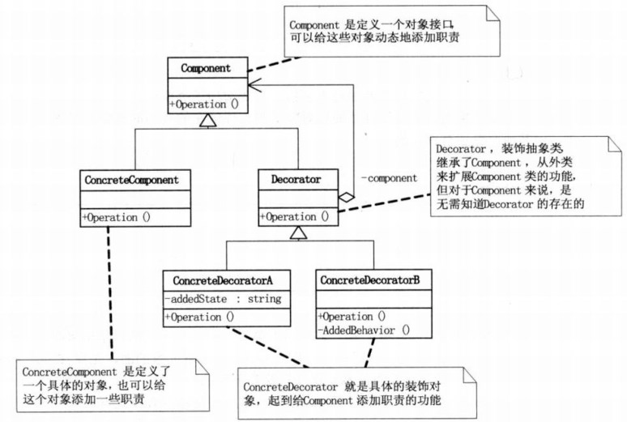
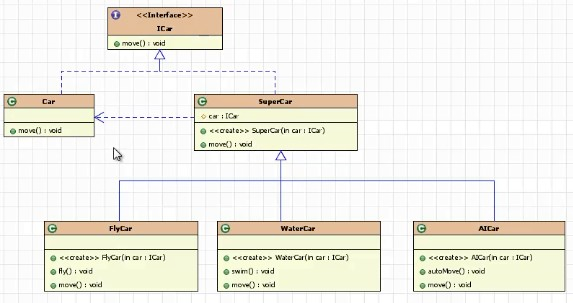

## 模式介绍

装饰模式（decorator）：表示动态的给一个对象添加一些新的功能（利用子类继承父类也可以实现），但是比生成子类方式更灵活。

也叫装饰者模式或者装饰器模式

例如：我们每个人身上穿的衣服，鞋子，领带，披风都可以理解为是对人的装饰。

装饰器模式类图：



Component：定义一个对象接口，可以给这些对象动态添加职责。真实对象和装饰者对象有相同的接口，这样客户端不用知道内部有装饰者对象（Decorator）

存在的，还是以之前处理真实对象的相同方式来和装饰者对象交互。

ConcreteComponent：是定义了一个具体的对象（例如：人），也可以给这个对象添加一些其他职责。

Decorator：装饰抽象类，继承了Component，从外类来扩展Component类的功能，但对Component来说，是无需知道Decorator存在的。

ConcreteDecorator：就是具体的装饰对象了（衣服，鞋子..），它起到了给Component添加职责的功能。

## 实例代码

定义一个Component对象接口（ICar），汽车移动

```java
/**
 * ICar表示Component：
 */
public interface ICar {
    void move();//汽车移动
}
```

定义一个具体真实的对象ConcreteComponent：这里是Car，就是具体的汽车，未装饰的汽车

```java
//ConcreteComponent：具体的对象
class Car implements ICar {
    @Override
    public void move() {
        System.out.println("汽车移动");
    }
}
```

装饰抽象类Decorator：SuperCar这里需要持有一个真实对象的引用，也就是Car对象

```java
//Decorator：装饰抽象类
class SuperCar implements ICar {
    protected ICar car;//持有一个真实对象的引用

    @Override
    public void move() {
        car.move();//这里调用真实对象的移动方法
    }

    //构造的时候传参
    public SuperCar(ICar car) {
        super();
        this.car = car;
    }
}
```

开始实现具体的装饰对象ConcreteDecorator

```java
//ConcreteDecorator：就是具体的装饰对象
class FlayCar extends SuperCar {
    public FlayCar(ICar car) {
        super(car);
    }

    //这里就是新增的功能
    public void flay() {
        System.out.println("---天上飞");
    }

    @Override
    public void move() {
        super.move();
        flay();//在原有移动的基础上，装饰了一个fly的功能
    }
}

//ConcreteDecorator：就是具体的装饰对象
class WaterCar extends SuperCar {
    public WaterCar(ICar car) {
        super(car);
    }

    //这里就是新增的功能
    public void swim() {
        System.out.println("---水里游");
    }

    @Override
    public void move() {
        super.move();
        swim();//在原有移动的基础上，装饰了一个swim的功能
    }
}
```

测试代码：

```java
public static void main(String[]args){
        Car car=new Car();
        car.move();//这里打印未增加新功能的时候：汽车移动

        System.out.println("--------增加飞行功能-------");
        FlayCar flyCar=new FlayCar(car);//将真实对象传入装饰对象中
        flyCar.move();//这里就是增加了飞行后的装饰

        System.out.println("--------增加潜水功能-------");
        WaterCar waterCar=new WaterCar(car);//将真实对象传入装饰对象中
        waterCar.move();//这里就是增加了潜水功能后的装饰

        }
```

控制台结果就是：

```text
汽车移动
--------增加飞行功能-------
汽车移动
---天上飞
--------增加潜水功能-------
汽车移动
---水里游
```

整个例子的类图结构如下：



## 总结

装饰模式（Decorator）也叫包装器模式（Wrapper）

> 装饰模式降低系统的耦合度，可以动态的增加或删除对象的职责，并使得需要装饰的具体构建类和具体装饰类可以独立变化以便增加新的具体构建类和具体装饰类。

**优点：**

- 扩展功能强，相比继承来说更灵活。继承的话会导致子类个数增加。而装饰者模式不会出现这种情况。
- 可以对一个对象进行多次装饰，创造出不同行为的组合，得到功能更加强大的对象。
- 具体构建类和具体装饰类可以独立变化，用户可以根据需要自己增加新的构件子类和具体装饰类。

**缺点：**

- 产生很多小对象，大量小对象会占据内存。一定程度上影响了性能。
- 装饰模式易于出错，调试排查比较麻烦。 

**开发中应用的场景：**

- IO中输入流和输出流
- Swing包中图形界面构件功能
- Servlet API中提供了一个request对象的Decorator设计模式的默认实现类HttpServletRequestWrapper,增强了request对象的功能。
- Struts2中，request，response，session对象的处理。

**装饰模式和桥接模式的区别：**

> 两个模式都是为了解决过多子类对象的问题，桥接模式是对象自身有过多的维度，造成过多的子类。而让维度分类后在搭建一个桥梁来联系起来。而装饰模式是解决在增加新功能的时候产生多个类的问题。


