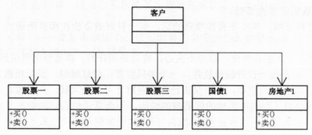
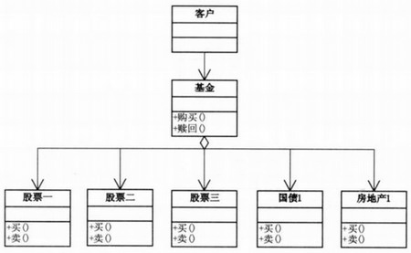
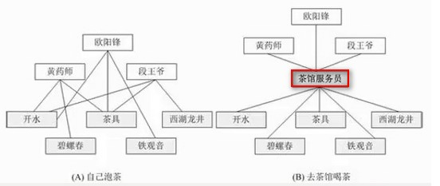
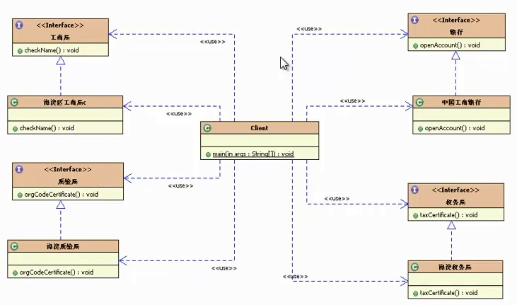
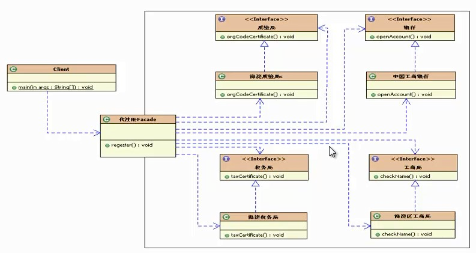
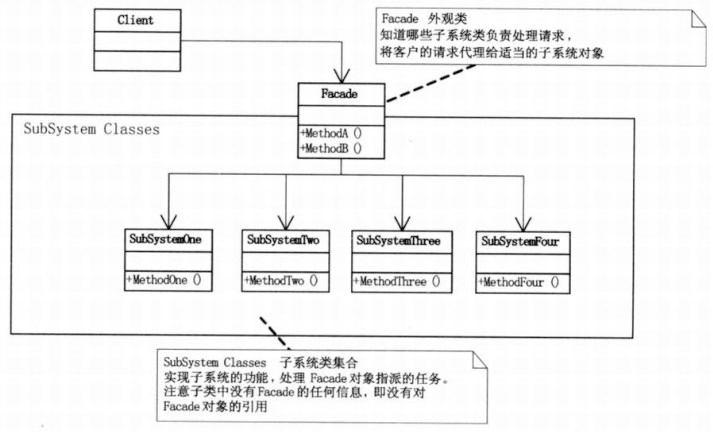

## 模式介绍

面向对象的一个比较重要的法则：迪米特法则（最少知识原则）：一个软件实体应当尽可能少的与其他实体发生相互作用。

外观模式：为子系统中的一组接口提供一个一致的界面，此模式定义了一个高层接口。这个接口使得这一子系统更加容易使用。说白了，就可以理解为封装

外观模式的核心：为子系统提供统一的入口，封装子系统的复杂性，便于客户端调用

例1：股民炒股

未使用外观模式情况



要让股民尽可能少的与股票直接打交道，给其提供一个蒙面，让股民跟蒙面打交道。这样就符合了迪米特法则，让股民尽可能少的与股票打交道了。

增加了外观模式后的类图：



例2：客户喝茶，客户要尽可能少的与子系统（开水，茶具，茶叶...）打交道，提供一个服务员，统一了喝茶的入口。



例3：公司注册流程

未使用外观模式的注册流程



使用了外观模式后呢？也就是找个代理公司来帮我们做这些事



外观模式类结构图：



## 实例代码

外观模式代码实现

未使用外观模式情况下，代码如下

子系统代码：

```java
package com.fz.facade;

/**
 * 所有子系统
 */
public class SubSystemClass {
    public void methodOne() {
        System.out.println("子系统方法1");
    }
}

class SubSystemClass2 {
    public void methodTwo() {
        System.out.println("子系统方法2");
    }
}

class SubSystemClass3 {
    public void methodThree() {
        System.out.println("子系统方法3");
    }
}
```

测试代码：

```java
public static void main(String[]args){
    //未使用外观模式情况
    SubSystemClass s1=new SubSystemClass();
    SubSystemClass2 s2=new SubSystemClass2();
    SubSystemClass3 s3=new SubSystemClass3();
    s1.methodOne();
    s2.methodTwo();
    s3.methodThree();
}
```

**增加外观模式后：新增一个Facade类**

```java
package com.fz.facade;

/**
 * 外观模式：封装子系统，对外提供一个门面方法
 */
public class Facade {
    //所有子系统的引用
    private SubSystemClass s1 = null;
    private SubSystemClass2 s2 = null;
    private SubSystemClass3 s3 = null;

    //构造子系统的引用
    public Facade() {
        this.s1 = new SubSystemClass();
        this.s2 = new SubSystemClass2();
        this.s3 = new SubSystemClass3();
    }

    /**
     * 具体的外观方法
     */
    public void facade() {
        s1.methodOne();
        s2.methodTwo();
        s3.methodThree();
    }
}
```

再次测试：

```java
public static void main(String[]args){
    //使用了外观模式后
    System.out.println("-----------------------");
    Facade facade=new Facade();
    facade.facade();
}
```

两次的输出结果为：

```text
子系统方法1
子系统方法2
子系统方法3
-----------------------
子系统方法1
子系统方法2
子系统方法3
```

## 总结

### 常见应用场景

其实外观模式就是我们常见的封装，在我们实际开发中，遇到的各种对子系统各模块封装的逻辑，都可以理解为外观模式 JDBC封装后的，commons提供的DBUtils类 Hibernate提供的工具类，Spring JDBC工具类等
