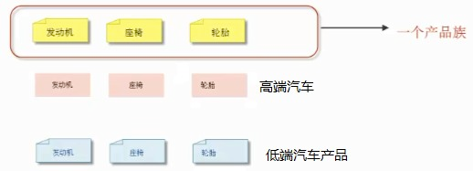

## 模式介绍

工厂模式实现了创建者和调用者的分离

### 工厂模式分类

1. 简单工厂模式
2. 工厂方法模式：定义一个用于创建对象的接口，让子类决定实例化哪一个类，工厂方法使一个类的实例化延迟到其子类
3. 抽象工厂模式：提供一个创建一系列相关或相互依赖对象的接口，而无需指定它们具体的类。

### 面向对象设计的基本原则

- OCP（开闭原则，Open-Closed Principle）：
    - 一个软件的实体应当对扩展开放，对修改关闭。也就是说如果你要对一个已存在的系统做扩展的时候尽量要新增加类，而不是在原有的基础上修改。
- DIP（依赖倒转原则，Dependence Inversion Principle）
    - 针对接口编程，不要针对实现编程。
- LoD（迪米特法则，Law Of Demeter）
    - 只与你直接的朋友通信，而避免和陌生人通信。一个类尽量少的依赖其他类

## 实例代码

### 未使用工厂模式的情况

```java
//汽车接口
public interface Car {
    void run();
}

//奥迪
public class Audi implements Car {
    @Override
    public void run() {
        System.out.println("奥迪在跑");
    }
}

//比亚迪
public class Byd implements Car {
    @Override
    public void run() {
        System.out.println("比亚迪在跑。");
    }
}

//汽车测试类
public class TestCar {//调用者

    public static void main(String[] args) {
        Car c1 = new Byd();
        Car c2 = new Audi();
        c1.run();
        c2.run();
        //未使用工厂模式的时候，调用者会依赖很多类。违反了开闭原则
    }
}
```

### 简单工厂模式：虽然能通过工厂来创建对象，但是违反了开闭原则。一旦增加功能需要在原有基础上修改代码。

使用了简单工厂模式后：可以创建一个工厂类，该类中提供一个创建汽车的工厂（方法）

```java
//汽车工厂
public class CarFactory {
    /**
     * 创建汽车
     * @param type
     * @return
     */
    public static Car createCar(String type) {
        //该方法还会有问题，假如以后有很多汽车都需要工厂来创建。则又得修改源代码，违反了OCP开闭原则
        if ("audi".equals(type)) {
            return new Audi();
        } else if ("byd".equals(type)) {
            return new Byd();
        } else {
            return null;
        }
    }
}

//测试简单工厂方法
public class TestSimpleFactoryCar {//调用者

    public static void main(String[] args) {
        //创建汽车
        Car audi = CarFactory.createCar("audi");//创建者
        Car byd = CarFactory.createCar("byd");
        audi.run();
        byd.run();
    }
}
```

### 工厂方法模式：将工厂类调整为工厂接口，需要什么类型的工厂就使用该类实现该工厂，创建相应的产品。

```java
//工厂接口
public interface CarFactory {
    //创建汽车方法
    Car createCar();
}

//创建比亚迪汽车的工厂
public class BydFactory implements CarFactory {
    @Override
    public Car createCar() {
        return new Byd();
    }
}

//创建奥迪的工厂
public class AudiFactory implements CarFactory {
    @Override
    public Car createCar() {
        return new Audi();
    }
}

//测试工厂方法
public class TestFactoryMethod {
    public static void main(String[] args) {
        /**
         * 工厂方法模式好处在于，以后如果再增加一辆车。只需再实现CarFactory接口即可。避免了OCP开闭原则
         * 不用在原来的代码上修改，只需新增类即可。
         * 例如:增加一辆奔驰，增加一个奔驰工厂BenzFactory即可。更好扩展
         */
        Car audi = new AudiFactory().createCar();
        Car byd = new BydFactory().createCar();
        audi.run();
        byd.run();
    }
}
```

### 抽象工厂模式：抽象工厂模式用来生产不同产品族的全部产品，对于只增加产品某一部分则不适用。抽象工厂模式是工厂模式的一种升级版本。

在有多个业务品种，业务分类时，抽象工厂能产品不同类别的一个全部产品。例如：生产汽车，抽象工厂模式可以生产高端汽车全部配件来组成一个高端汽车，

低端汽车全部配件来组成要给低端的汽车，但是不能产生一个高端的发动机和一个低端的座椅来组成一个中等的汽车。这样会混乱。



代码实现：

首先使用一个接口来定义一个发动机，使用具体的类来定义发动机的好坏（具体实现）

```java
/**
 * 发动机接口
 */
public interface Engine {
    void run();

    void start();
}

//好的发动机
class LuxuryEngine implements Engine {
    @Override
    public void run() {
        System.out.println("好发动机转的快");
    }

    @Override
    public void start() {
        System.out.println("启动快，自动启停");
    }
}

//差的发动机
class LowEngine implements Engine {
    @Override
    public void run() {
        System.out.println("转的慢");
    }

    @Override
    public void start() {
        System.out.println("启动慢");
    }
}
```

定义一个汽车总工厂，用来生产各种类型的汽车。所有的汽车都需要依赖此工厂来生产汽车。

```java
/**
 *  汽车总工厂，可以创建轮胎，座椅，发动机
 */
public interface CarFactory {
    Engine createEngine();//创建发动机

    Seat createSeat();//创建座椅

    Tyre createTyre();//创建轮胎
}
```

然后根据生产的不同产品，类创建具体的实现来生产汽车。例如：专门生产高端的汽车，专门生产低端的汽车。都可以用针对CarFactory具体的实现来创建。

高端汽车制造工厂，所有汽车的生产必须依赖汽车总工厂

```java
/**
 *  高端汽车制造工厂
 */
public class LuxuryCarFactory implements CarFactory {
    @Override
    public Engine createEngine() {
        return new LuxuryEngine();
    }

    @Override
    public Seat createSeat() {
        return new LuxurySeat();
    }

    @Override
    public Tyre createTyre() {
        return new LuxuryTyre();
    }
}
```

低端汽车制造工厂，所有汽车的生产必须依赖汽车总工厂

```java
/**
 *  低端汽车制造工厂
 */
public class LowCarFactory implements CarFactory {
    @Override
    public Engine createEngine() {
        return new LowEngine();
    }

    @Override
    public Seat createSeat() {
        return new LowSeat();
    }

    @Override
    public Tyre createTyre() {
        return new LowTyre();
    }
}
```

具体生产汽车的时候就可以根据需要来创建具体的汽车了。

```java
public static void main(String[]args){
        //想要好车
        CarFactory factory=new LuxuryCarFactory();
        Engine engine=factory.createEngine();//创建高端发动机
        engine.run();
        engine.start();

        //想要差一点的车
        CarFactory factory2=new LowCarFactory();
        Engine e2=factory2.createEngine();
        Seat s2=factory2.createSeat();
        Tyre t2=factory2.createTyre();
        e2.run();
        e2.start();
        //以后想要中等车的话可以增加相应中等配件的接口
        }
```

以上就是一个针对产品族的工厂，用来生产一个产品，而不是一个配件。假如以后想生产一个中端汽车产品。就可以增加相应的类，实现汽车总工厂CarFactory来生产。

## 模式要点

1. 简单工厂模式（静态工厂模式）
    1. 虽然某种程度不符合面向对象规则（不符合开闭原则，每次新增内容都需要在原有代码上修改），但是实际使用最多。
2. 工厂方法模式
    1. 不修改已有类的前提下，通过增加新类来实现扩展。
3. 抽象工厂模式
    1. 不可以增加产品中某一个配件，可以增加一个具体的产品族。

## 总结

### 常见应用场景

- JDK中的Calendar的getInstance方法
- JDBC中Connection对象的获取getConnection
- Hibernate中SessionFactory创建Session
- spring中的IOC容器创建管理bean对象的时候也是工厂模式
- XML解析时的DocumentBuilderFactory创建解析器对象
- 反射中Class对象的newInstance方法。
