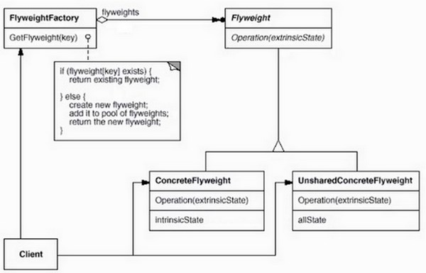
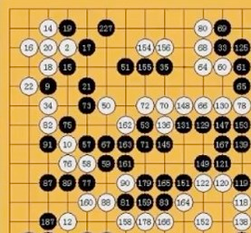

## 模式介绍

享元模式（FlyWeight）：运用共享技术有效的支持大量细粒度对象的重用。

应用场景：如果项目中有很多完全相同或相似的对象，则可以使用享元模式，节省内存。

享元对象能做到共享的关键就是区分了内部状态和外部状态。

内部状态：可以共享，不会随环境变化而变化

外部状态：不可以共享，会随环境变化而变化

享元模式UML图



FlyweightFactory（享元工厂类）：创建并管理享元对象，享元池一般设计成键值对

FlyWeight（抽象享元类）：通常是一个接口或者抽象类，声明公共方法，这些方法可以向外界提供对象的内部状态，设置外部状态。

ConcreteFlyWeight（具体享元类）：为内部状态提供成员变量进行存储

UnsharedConcreteFlyWeight（非共享享元类）：不能被共享的子类可以设计为非共享享元类

例如：围棋中的享元模式，在围棋中，所有的白色或黑色的（形状、大小，颜色都一样）只是位置不同，那像这样的情况，可以使用享元模式。



把颜色、形状、大小给共享出来（内部状态）。位置不共享（外部状态）

## 实例代码

将棋子例子用代码实现

FlyWeight（抽象享元类）：

```java
/**
 * 享元类接口：可以共享的有颜色，大小，形状
 * FlyWeight（抽象享元类）：通常是一个接口或者抽象类，声明公共方法，
 * 这些方法可以向外界提供对象的内部状态，设置外部状态。
 */
public interface ChessFlyWeight {
    //这里只设置一个颜色,大小和形状省略
    void setColor(String c);

    String getColor();

    void display(Coordinate c);//显示棋子
}
```

ConcreteFlyWeight（具体享元类）：为内部状态提供成员变量进行存储

```java
//享元的具体实现：ConcreteFlyWeight（具体享元类）：为内部状态提供成员变量进行存储
class concreteFlyWeight implements ChessFlyWeight {
    private String color;//这里就是为内部状态提供成员变量进行存储

    //构造的时候初始化color属性
    public concreteFlyWeight(String color) {
        super();
        this.color = color;
    }

    @Override
    public void setColor(String c) {
        this.color = c;
    }

    @Override
    public String getColor() {
        return color;
    }

    @Override
    public void display(Coordinate c) {
        System.out.println("棋子颜色：" + color);
        System.out.println("棋子位置：(" + c.getX() + "," + c.getY() + ")");
    }
}
```

UnsharedConcreteFlyWeight（非共享享元类）：不能被共享的子类可以设计为非共享享元类

```java
/**
 * 坐标类（外部状态）：棋子位置
 * UnsharedConcreteFlyWeight（非共享享元类）：不能被共享的子类可以设计为非共享享元类
 */
public class Coordinate {
    private int x, y;//坐标位置

    public Coordinate(int x, int y) {
        super();
        this.x = x;
        this.y = y;
    }

    public int getX() {
        return x;
    }

    public void setX(int x) {
        this.x = x;
    }

    public int getY() {
        return y;
    }

    public void setY(int y) {
        this.y = y;
    }
}
```

定义一个FlyweightFactory（享元工厂类）：

```java
/**
 * 享元工厂
 * FlyweightFactory（享元工厂类）：创建并管理享元对象，享元池一般设计成键值对
 */
public class ChessFlyWeightFactory {
    //享元池：存放享元对象
    private static Map<String, ChessFlyWeight> map = new HashMap<String, ChessFlyWeight>();

    //提供一个享元工厂:创建和管理棋子
    public static ChessFlyWeight getChess(String color) {
        if (map.get(color) != null) {
            return map.get(color);
        } else {
            ChessFlyWeight chess = new concreteFlyWeight(color);
            map.put(color, chess);
            return chess;
        }
    }
}
```

测试享元模式代码：

```java
public static void main(String[]args){
        ChessFlyWeight chess1=ChessFlyWeightFactory.getChess("黑色");//黑1
        ChessFlyWeight chess2=ChessFlyWeightFactory.getChess("黑色");//黑2
        System.out.println(chess1==chess2);//结果为true，相同或相似对象内存中只存在一份

        //使用享元的外部状态
        chess1.display(new Coordinate(10,10));//黑1在10,10的位置
        chess2.display(new Coordinate(20,20));//黑2在20,20的位置

        }
```

结果为：

```text
true
棋子颜色：黑色
棋子位置：(10,10)
棋子颜色：黑色
棋子位置：(20,20)
```

## 总结

### 常见应用场景

比如线程池，数据库连接池，这些都利用享元模式共享了部分属性，在池中操作。

String类的设计也是享元模式

**优点：**

- 极大的减少内存中对象的数量
- 相同或相似对象内存中只存在一份，极大的节约资源，提高系统性能
- 外部状态相对独立，不影响内部状态

**缺点：**

- 模式较复杂，使程序逻辑复杂化
- 为了节省内存，共享了内部状态，分离出外部状态，而读取外部状态使运行时间变长。
