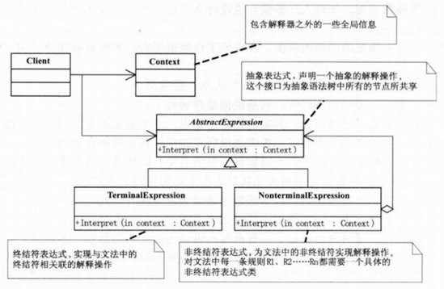

## 模式介绍

解释器模式：给定一个语言，定义它的文法一种表示。并定义一个解释器，这个解释器使用该表示来解释语言中的句子。

也就是说，如果你想自己开发一种语言来解释执行某些语言的特定语法，可以考虑使用解释器模式。

该模式对于我们开发人员来说，基本上都用不到。除非你想自己开发一种语言。

解释器模式真正开发起来很难，就相当于自己开发了一种语言给别人用。

解释器模式UML图：

## 总结

### 常见应用场景

- 通常来说，当有一个语言需要解释执行，并且你可将该语言中的句子表示为一个抽象语法树叶，则可以使用解释器模式。
- EL表达式的处理
- 正则表达式解释器
- SQL语法的解释器
- 数学表达式解释器：Math 、 Expression String Parser 、 Expression4J
