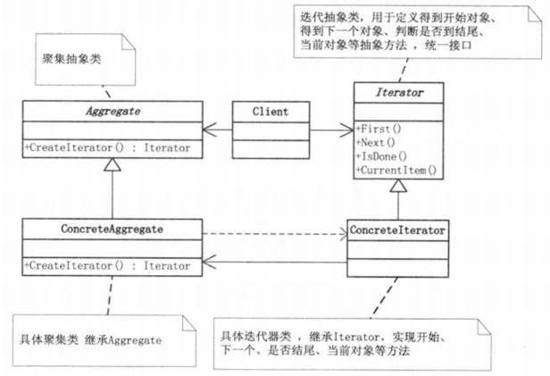

## 模式介绍

迭代器模式：提供一种方法顺序的访问一个聚合对象中各个元素，而又不暴露该对象的内部表示。

一般情况，我们自己开发时很少自定义迭代器，因为java本身已经把迭代器做到内部中了（比如：常用的list和set中都内置了迭代器）。

当然，如果真有这种需求需要我们自定义迭代器的话，可以参考jdk的迭代器实现方式来实现自己的迭代器。

迭代器是可以从前往后，或者从后往前遍历的。

为遍历不同聚集结构提供如：开始，下一个，是否有下一个，是否结束，当前哪一个等等的一个统一接口。

迭代器模式UML图：


聚集类：Aggregate(抽象类)和ConcreteAggregate(具体聚集类)表示聚集类，是用来存储迭代器的数据。

在Aggregate(抽象类)中有一个CreateIterator方法，用来获取迭代器

迭代器：迭代器用来为聚集类提供服务，提供了一系列访问聚集类对象元素的方法。

## 实例代码

首先定义一个迭代器的抽象，这里使用接口定义

```java
//迭代器接口
public interface MyIterator {
    void first();//将游标指向第一个元素

    void next();//将游标指向下一个元素

    boolean hasNext();//判断是否有下一个元素

    boolean isFirst();//判断是否是第一个元素

    boolean isLast();//判断是否是最后一个元素

    Object getCurrentObj();//获取当前对象
}
```

然后自定一个一个聚集类，这里直接使用一个class来定义了。在聚集类内部，使用内部类的方式来定义迭代器的具体实现。

```java
import java.util.ArrayList;
import java.util.List;

//自定义聚集类
public class ConcreteMyAggregate {
    private List<Object> list = new ArrayList<>();

    public void addObject(Object obj) {
        this.list.add(obj);
    }

    public void removeObject(Object obj) {
        this.list.remove(obj);
    }

    public List<Object> getList() {
        return list;
    }

    public void setList(List<Object> list) {
        this.list = list;
    }

    //获得迭代器
    public MyIterator createIterator() {
        return new ConcreteIterator();
    }

    //使用内部类来定义迭代器，好处就是可以直接使用外部类的属性
    private class ConcreteIterator implements MyIterator {
        private int cursor;//定义一个迭代器游标

        @Override
        public void first() {
            cursor = 0;
        }

        @Override
        public void next() {
            if (cursor < list.size()) {
                cursor++;
            }
        }

        @Override
        public boolean hasNext() {
            //如果游标<list的大小，则说明还有下一个
            if (cursor < list.size()) {
                return true;
            }
            return false;
        }

        @Override
        public boolean isFirst() {
            return cursor == 0 ? true : false;
        }

        @Override
        public boolean isLast() {
            //判断游标是否是容器的最后一个
            return cursor == (list.size() - 1) ? true : false;
        }

        @Override
        public Object getCurrentObj() {
            return list.get(cursor);//获取当前游标指向的元素
        }
    }

}
```

客户端测试代码：

```java
public static void main(String[]args){
        ConcreteMyAggregate cma=new ConcreteMyAggregate();
        cma.addObject("111");
        cma.addObject("222");
        cma.addObject("333");
        cma.addObject("444");

        MyIterator iterator=cma.createIterator();
        cma.removeObject("111");//如果删除一个元素的话，迭代的时候也同样会被删除
        while(iterator.hasNext()){
        System.out.println(iterator.getCurrentObj());//获取当前对象
        iterator.next();//将游标向下移
        }
        }
```

测试结果如下：

```text
222
333
444
```
