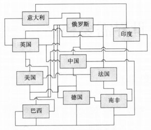
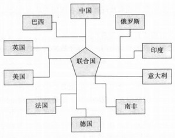
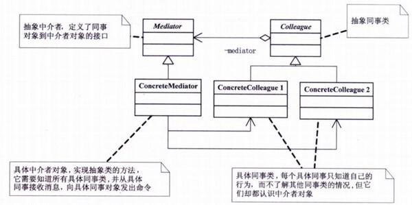
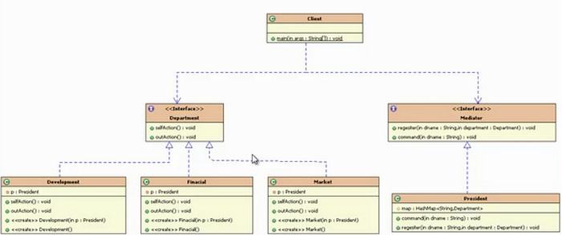

## 模式介绍

中介者模式：用一个中介对象来封装一系列的对象交互，中介者使各对象不需要显示地相互引用。从而使其耦合松散，而且可以独立地改变它们之间的交互。

中介者模式核心：1.就是将网状结构处理成星型结构 2.将多对多处理成一对多

例如：世界上各个国家的和平和安全，沟通和交流等等问题，如果各个国家都可以互相交互的话，容易造成混乱，关系复杂。


这个时候联合国的作用就出现了，联合国作为一个中介对象来维护各个国家的和平和安全等等的工作。



中介者模式UML图：


例如：公司中如果没有部门经理，部门中的职员之间的工作沟通，职员和总监工作的沟通，职员和其他部门职员的沟通等等。会造成混乱，每个部门或者每个层级，都需要一个领导人来作为中介和其他组织的人沟通。

Colleague（抽象同事类）：

ConcreteColleague（具体同事类）：每个具体同事只知道自己的行为，而不了解其他同事类的情况，但他们都认识中介者对象。

Mediator（抽象中介者）：定义了同事对象和中介者对象的接口

ConcreteMediator（具体中介者对象）：实现抽象中介者的方法，它需要知道所有具体同事类，并从具体同事接收消息，向具体同事对象发出命令。

## 实例代码

这里以公司各部门之间交互，使用中介者（总经理）的方式来代码实现。

首先定义一个抽象中介者（Mediator）对象：这里使用一个接口来定义

```java
//抽象中介者
public interface Mediator {
    void register(String dname, Department d);//将具体的同事类注册到中介者中，让中介者知道所有的同事。以便进行交互

    void command(String dname);//通过部门名称，发出命令
}
```

再定义一个抽象同事类（Colleague）：仍然使用一个接口来定义

```java
//抽象同事类：部门
public interface Department {
    void selfAction();//做本部门的事

    void outAction();//向总经理发出申请
}
```

然后可以开始定义具体的实现了，先定义抽象同事的具体实现（ConcreteColleague）

研发部：

```java
//具体同事类：研发部
public class Development implements Department {
    private Mediator m;//中介者（总经理）

    //构造的时候将中介者构造进来
    public Development(Mediator m) {
        super();
        this.m = m;
        //ConcreteMediator（具体中介者对象）：实现抽象中介者的方法
        //它需要知道所有具体同事类，并从具体同事接收消息，向具体同事对象发出命令。
        m.register("development", this);//将当前部门对象注册到中介者对象中，
    }

    @Override
    public void selfAction() {
        System.out.println("研发部：正在研发项目......");
    }

    @Override
    public void outAction() {
        System.out.println("研发部向总经理说：项目经费没了.....");
    }
}
```

财务部：

```java
//具体同事类：财务部
public class Finacial implements Department {
    private Mediator m;//中介者（总经理）

    //构造的时候将中介者构造进来
    public Finacial(Mediator m) {
        super();
        this.m = m;
        //ConcreteMediator（具体中介者对象）：实现抽象中介者的方法
        //它需要知道所有具体同事类，并从具体同事接收消息，向具体同事对象发出命令。
        m.register("finacial", this);//将当前部门对象注册到中介者对象中，
    }

    @Override
    public void selfAction() {
        System.out.println("财务部：会计正在核对财务......");
    }

    @Override
    public void outAction() {
        System.out.println("财务部向总经理说：钱很多，花不完.....");
    }
}
```

市场部：

```java
//具体同事类：市场部
public class Market implements Department {
    private Mediator m;//中介者（总经理）

    //构造的时候将中介者构造进来
    public Market(Mediator m) {
        super();
        this.m = m;
        //ConcreteMediator（具体中介者对象）：实现抽象中介者的方法
        //它需要知道所有具体同事类，并从具体同事接收消息，向具体同事对象发出命令。
        m.register("market", this);//将当前部门对象注册到中介者对象中，
    }

    @Override
    public void selfAction() {
        System.out.println("市场部：正在跑市场......");
    }

    @Override
    public void outAction() {
        System.out.println("市场部向总经理说：合同已搞定，需财务部报销.....");
        m.command("finacial");//通过总经理这个中介，向总经理发出申请，告知需要跟财务部交互报销经费
    }
}
```

注意这里！！！

> m.command("finacial"); // 这里通过总经理这个中介者对象，向财务部发出了申请。

通过中介者对象和财务部交互而没有直接跟财务部打交道

定义具体的中介者（ConcreteMediator）：总经理

```java
//中介者的具体实现：总经理
public class President implements Mediator {
    //总经理也需要知道所有具体同事类
    private Map<String, Department> map = new HashMap<String, Department>();

    @Override
    public void register(String dname, Department d) {
        map.put(dname, d);//将同事注册到总经理的所有同事类容器中
    }

    @Override
    public void command(String dname) {
        map.get(dname).selfAction();//根据部门名称向具体的部门下命令
    }
}
```

现在开始测试：

市场部需要向财务部发出申请，这时候就可以通过中介者（总经理）来向财务部发出申请了。而不是直接调用财务部的方法

```java
public static void main(String[]args){
        Mediator m=new President();//构建中介者对象：总经理
        Market market=new Market(m);//构建市场部
        market.selfAction();
        market.outAction();//市场部和财务部交互
        }
```

输出结果：

```text
市场部：正在跑市场......
市场部向总经理说：合同已搞定，需财务部报销.....
财务部：会计正在核对财务......
```

代码的UML图如下：


## 总结

中介者模式的本质：解耦多个同事对象之间的交互关系，每个对象都持有中介者对象的引用。只跟中介者对象打交道。

通过中介者对象统一管理这些交互对象。

### 常见应用场景

- MVC模式中的C部分，M和V都和它打交道
- Java.lang.reflect.Method#invoke()
