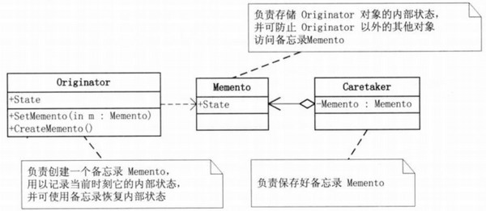

## 模式介绍

备忘录模式：在不破坏封装性的前提下，捕获一个对象的内部状态，并在该对象之外保存这个状态。这样以后就可将该对象恢复到原先保存的状态。

例如：

1.office重新打开时的恢复功能。

2.事务的回滚操作

备忘录模式UML图：


Originator（发起人）：负责创建一个备忘录Memento，用以记录当前时刻它的内部状态，并可使用备忘录恢复内部状态。

Originator可根据需要决定Memento存储Originator的哪些内部状态

Memento（备忘录）：负责存储Originator对象的内部状态，并可防止Originator以外的其他对象访问备忘录Memento。

备忘录有两个接口，Caretaker只能看到备忘录的窄接口，它只能将备忘录传递给其他对象。Originator能够看到一个宽接口，允许它访问返回到

先前状态所需的所有数据。

Caretaker（管理者）：负责保存好备忘录Memento，不能对备忘录的内存进行操作或检查。

## 实例代码

以一个Emp实体对象来作为例子

首先，创建一个发起人：发起人内部保存着需要备忘的属性，它负责创建一个备忘录Memento，用以记录当前时刻它的内部状态，并可使用备忘录恢复内部状态。

```java
//发起人：发起人内部有自身的内部状态，并且发起人可以创建备忘录和恢复备忘录
public class EmpOriginator {
    //需要备份的自身属性
    private String ename;
    private int age;
    private double salary;

    //备份
    public EmpMemento memento() {
        return new EmpMemento(this);//将当前自身对象备份
    }

    //恢复
    public void recovery(EmpMemento emp) {
        this.ename = emp.getEname();
        this.age = emp.getAge();
        this.salary = emp.getSalary();
    }
    //省略get，set和带参构造器  
}
```

创建备忘录对象：备忘录就是用来备份发起人的数据，所以构造器需要提供一个发起人对象

```java
//备忘录对象
public class EmpMemento {
    //自身属性
    private String ename;
    private int age;
    private double salary;

    //构造备忘录对象时，需要传入一个需要备忘的对象（发起人）
    public EmpMemento(EmpOriginator emp) {
        this.ename = emp.getEname();
        this.age = emp.getAge();
        this.salary = emp.getSalary();
    }
    //省略3个属性的set,get方法
}
```

开始创建一个备忘录的管理者

```java
//管理者：管理备忘录对象
public class CareTaker {
    //需要管理的备忘录对象，这里也可以使用一个list容器来存储。这样可以备份多个点  
    private EmpMemento empMemento;

    public EmpMemento getEmpMemento() {
        return empMemento;
    }

    public void setEmpMemento(EmpMemento empMemento) {
        this.empMemento = empMemento;
    }
}
```

单次备份测试：测试只能备份一次的备忘录

```java
public static void main(String[]args){
        CareTaker taker=new CareTaker();//构建一个备忘录管理者
        //构建发起人
        EmpOriginator emp=new EmpOriginator("张三",20,4000);
        System.out.println("第一次："+emp.getEname()+"---"+emp.getAge()+"---"+emp.getSalary());
        //备份
        taker.setEmpMemento(emp.memento());

        //备份完了后再修改
        emp.setEname("李四");
        emp.setAge(30);
        emp.setSalary(50000);
        //然后再次打印
        System.out.println("修改后："+emp.getEname()+"---"+emp.getAge()+"---"+emp.getSalary());

        //开始恢复
        emp.recovery(taker.getEmpMemento());
        System.out.println("恢复后："+emp.getEname()+"---"+emp.getAge()+"---"+emp.getSalary());
        }
```

测试结果如下：

```text
第一次：张三---20---4000.0
修改后：李四---30---50000.0
恢复后：张三---20---4000.0
```

但是，这样的效果是只能备份一次。有时候我们需要备份多个点，根据需要来还原具体哪次的数据

多次备份

使用Stack来存储备份数据，进行多次备份。用Stack的好处是Stack是后进先出的，也就是说：你最近一次备份的数据会优先获取到。

修改管理者中的代码：

```java
import java.util.Stack;

//管理者：管理备忘录对象
public class CareTaker {
    //需要管理的备忘录对象，这里也可以使用一个list容器来存储。这样可以备份多个点
    //或者使用一个Stack栈来保存，因为Stack是后进先出的
    private Stack<EmpMemento> stack = new Stack<EmpMemento>();

    //备份emp数据到栈中
    public void mementoEmp(EmpMemento emp) {
        stack.push(emp);
    }

    //从栈中获取最近一次备份的emp数据
    public EmpMemento getEmpForStack() {
        if (!stack.empty()) {
            return stack.peek();//peek只获取，不删除
        } else {
            return null;
        }
    }

    //从栈中获取最近一次备份的emp数据,并且从栈中删除该数据
    public EmpMemento getEmpForStackAndRemove() {
        if (!stack.empty()) {
            return stack.pop();//pop获取后删除该元素
        } else {
            return null;
        }
    }
}
```

再次测试：后进先出，也就是说。恢复的话恢复的是最后一次备份的数据

```java
public static void main(String[]args){
        CareTaker taker=new CareTaker();//构建一个备忘录管理者
        //构建发起人
        EmpOriginator emp=new EmpOriginator("张三",20,4000);
        System.out.println("第一次："+emp.getEname()+"---"+emp.getAge()+"---"+emp.getSalary());
        //第1次备份
        taker.mementoEmp(emp.memento());

        //备份完了后再修改
        emp.setEname("李四");
        emp.setAge(30);
        emp.setSalary(50000);
        //然后再次打印
        System.out.println("1修改后："+emp.getEname()+"---"+emp.getAge()+"---"+emp.getSalary());
        //第2次备份
        taker.mementoEmp(emp.memento());

        //备份完了后再修改
        emp.setEname("李四2");
        emp.setAge(32);
        emp.setSalary(52000);
        //然后再次打印
        System.out.println("2修改后："+emp.getEname()+"---"+emp.getAge()+"---"+emp.getSalary());
        //第3次备份
        taker.mementoEmp(emp.memento());

        //备份完了后再修改
        emp.setEname("李四3");
        emp.setAge(33);
        emp.setSalary(32000);
        //然后再次打印
        System.out.println("3修改后："+emp.getEname()+"---"+emp.getAge()+"---"+emp.getSalary());
        //第4次备份
        taker.mementoEmp(emp.memento());

        //开始恢复
        emp.recovery(taker.getEmpForStack());//恢复的是第4次备份的数据（3修改后）
        System.out.println("恢复后："+emp.getEname()+"---"+emp.getAge()+"---"+emp.getSalary());
        }
```

测试结果如下：

```text
第一次：张三---20---4000.0
1修改后：李四---30---50000.0
2修改后：李四2---32---52000.0
3修改后：李四3---33---32000.0
恢复后：李四3---33---32000.0
```

当然，也可以恢复之后把它从栈中删除。

测试：恢复之前从栈中删除两个最近的数据

```java
//开始恢复
taker.getEmpForStackAndRemove();//删除最近一次的备份
taker.getEmpForStackAndRemove();//删除最近一次的备份
emp.recovery(taker.getEmpForStack());//此时获取的是原来未删除时倒数第二次的备份
System.out.println("恢复后："+emp.getEname()+"---"+emp.getAge()+"---"+emp.getSalary());
```

此时的结果就是如下：可见，这里已经把2和3给删除了

```text
第一次：张三---20---4000.0
1修改后：李四---30---50000.0
2修改后：李四2---32---52000.0
3修改后：李四3---33---32000.0
恢复后：李四---30---50000.0
```

## 总结

### 常见应用场景

- 棋类游戏中的悔棋操作
- 软件中的撤销操作
- 数据库中的事务回滚操作
- 常用软件中的历史记录功能


