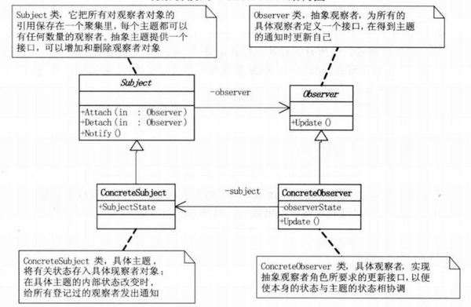

## 模式介绍

观察者模式（发布-订阅模式）：定义了一种一对多的依赖关系，让多个观察者对象同时监听某一个主题对象，这个主题对象在状态发生变化时，会通知所有观察者对象。使它们能够自动更新自己。

例如：

1、游戏中的例子：游戏中，当进入新人的时候，大喇叭会通知所有的玩家。所有的游戏玩家是订阅者，而大喇叭就是一个发布者。

2、QQ群聊天中：在群里聊天的时候，你发一句话，大家都可以看到。那么，这个群里的人就是订阅者，而通过群发消息的服务器则作为了一个发布者。

观察者模式UML图



**Subject（抽象主题）**：抽象主题中把所有观察者对象的引用都保存在一个集合里，每个主题都可以有任何数量的观察者，这个主题提供一个接口。来增加或者删除具体的观察者对象。

**ConcreteSubject（具体主题）**：具体主题中就操作了具体的观察者对象，将有关状态存入具体的观察者对象中，假如具体主题内部状态发生了改变。则给所有注册过的观察者发出更新的通知。然后具体的观察者则更新自己的状态。

**Observer（抽象观察者）**：为所有观察者定义一个接口，在得到主题的通知时则更新自己。

**ConcreteObserver（具体观察者）**：实现抽象观察者定义的接口，自身的状态随着主题的更新而更新。

## 实例代码

定义一个抽象观察者接口：相当于玩家角色，也可以使用抽象类。抽象观察者中只提供一个更新状态的方法，所有实现该抽象观察者的具体观察者，需要随着更新

```java
//抽象观察者:为所有的观察者定义一个接口
public interface Observer {
    //传入主题对象,得到主题对象的通知时更新自己
    void upadte(Subject subject);
}
```

具体的观察者：相当于具体的游戏玩家

```java
//具体的观察者
public class ConcreteObserver implements Observer {
    private int state;//state对象需要和subject中的state保持一致

    @Override
    public void upadte(Subject subject) {
        //当目标对象（主题对象）状态发生改变时，观察者也发生改变。
        this.state = ((ConcreteSubject) subject).getState();
    }

    public int getState() {
        return state;
    }

    public void setState(int state) {
        this.state = state;
    }
}
```

定义主题对象，主题对象中存储了所有该主题下的所有观察者，并提供增加和删除观察者的方法

```java
//抽象主题对象：把所有观察者对象都保存到一个集合里，每个主题都可以任何数量的观察者
//抽象主题对象提供了增加和删除观察者对象的方法
public class Subject {
    //保存该主题下所有的观察者
    protected List<Observer> list = new ArrayList<Observer>();

    //添加观察者
    public void registerObserver(Observer observer) {
        list.add(observer);
    }

    //删除观察者
    public void removerObserver(Observer observer) {
        list.remove(observer);
    }

    //通知所有观察者
    public void notifyAllObserver() {
        for (Observer obs : list) {
            obs.upadte(this);//更新当前主题（subject）对象的信息到所有观察者中
        }
    }
}
```

开始定义具体的主题对象：

```java
//具体的主题对象
public class ConcreteSubject extends Subject {
    private int state;//默认状态为0

    public int getState() {
        return state;
    }

    public void setState(int state) {
        this.state = state;
        //当修改了主题对象状态时，通知所有观察者
        this.notifyAllObserver();//通知所有观察者
    }
}
```

客户端测试代码

```java
public static void main(String[]args){
        //构建目标对象（主题对象）
        ConcreteSubject subject=new ConcreteSubject();
        //具体的观察者
        ConcreteObserver c1=new ConcreteObserver();
        ConcreteObserver c2=new ConcreteObserver();
        ConcreteObserver c3=new ConcreteObserver();
        c1.setState(10);//设置观察者1的状态为10
        c2.setState(20);//设置观察者2的状态为20
        c3.setState(30);//设置观察者3的状态为30
        //将三个观察者假如到观察者队列中
        subject.registerObserver(c1);
        subject.registerObserver(c2);
        subject.registerObserver(c3);
        //查看未修改时的状态
        System.out.println(c1.getState());
        System.out.println(c2.getState());
        System.out.println(c3.getState());

        System.out.println("-------------修改后的状态-------------");
        //改变目标对象的状态
        subject.setState(1000);
        //查看观察者对象的状态
        System.out.println(c1.getState());
        System.out.println(c2.getState());
        System.out.println(c3.getState());
        }
```

测试结果：

```text
10
20
30
-------------修改后的状态-------------
1000
1000
1000
```

这里我们是自己定义的Observer和Subject。其实java中已经帮我们写好了这两个目标对象接口和观察者接口

`java.util.Observable 这个类就相当于我们自己定义的subject类`

`java.util.Observer 接口`

下面，使用jdk提供的两个接口来实现一个观察者模式demo

定义一个具体的目标对象（原代码中的ConcreteSubject）：继承java.util.Observable类

```java
import java.util.Observable;

//具体的目标对象
public class ConcreteSubject extends Observable {
    private int state;

    public void updateState(int s) {
        state = s;//目标对象发生了改变
        setChanged();//Observable类中的setChanged()方法，表示目标对象发生了更改
        notifyObservers(state);//通知所有观察者对象
    }

    public int getState() {
        return state;
    }

    public void setState(int state) {
        this.state = state;
    }
}
```

定义具体的观察者：实现java.util.Observer接口

```java
import java.util.Observable;
import java.util.Observer;

//具体的观察者
public class ConcreteObserver implements Observer {
    private int state;//具体观察者中的状态和目标对象的状态保持一致

    @Override
    public void update(Observable o, Object arg) {
        state = ((ConcreteSubject) o).getState();
    }

    public int getState() {
        return state;
    }

    public void setState(int state) {
        this.state = state;
    }
}
```

客户端测试代码：使用addObserver来添加观察者到集合中

```java
public static void main(String[]args){
        //构建目标对象（主题对象）
        ConcreteSubject subject=new ConcreteSubject();
        //具体的观察者
        ConcreteObserver c1=new ConcreteObserver();
        ConcreteObserver c2=new ConcreteObserver();
        ConcreteObserver c3=new ConcreteObserver();
        c1.setState(10);//设置观察者1的状态为10
        c2.setState(20);//设置观察者2的状态为20
        c3.setState(30);//设置观察者3的状态为30
        //将三个观察者假如到观察者队列中
//      subject.registerObserver(c1);
//      subject.registerObserver(c2);
//      subject.registerObserver(c3);
        subject.addObserver(c1);//Observer接口中使用addObserver来添加观察者对象到集合中
        subject.addObserver(c2);
        subject.addObserver(c3);
        //查看未修改时的状态
        System.out.println(c1.getState());
        System.out.println(c2.getState());
        System.out.println(c3.getState());

        System.out.println("-------------修改后的状态-------------");
        //改变目标对象的状态
//      subject.setState(1000);
        subject.updateState(1000);//使用刚才定义的updateState方法来更新状态
        //查看观察者对象的状态
        System.out.println(c1.getState());
        System.out.println(c2.getState());
        System.out.println(c3.getState());
}
```

结果：

```text
10
20
30
-------------修改后的状态-------------
1000
1000
1000
```

## 总结

### 常见应用场景

1. 聊天室程序，服务器转发信息给所有客户端
2. 网络游戏（多人联机对战）场景中，服务器将客户端的状态进行分发
3. 邮件订阅
4. Servlet中，监听器的实现
5. Android的广播机制
6. JDK的AWT中事件处理模型
