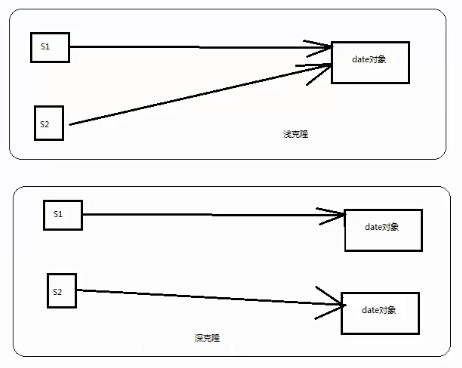

## 模式介绍

单原型模式：原型模式就是从一个对象再创建另外一个可定制的对象，而且不需要知道任何创建的细节。

所谓原型模式，就是java中的克隆技术，以某个对象为原型。复制出新的对象。显然新的对象具备原型对象的特点。效率高（避免了重新执行构造过程步骤）

克隆类似于new，但和new不同。new创建新的对象属性采用的是默认值。克隆出来的对象的属性值完全和原型对象相同。并且克隆出的新对象不会影响原型对象，克隆后。还可以再修改克隆对象的值。

要实现原型模式，必须实现Cloneable接口，而这个接口里面是空的。

**Cloneable接口是一个空接口，使用Cloneable接口都不用导入包。而clone方法是属于Object对象的。如果要克隆某个对象的话必须实现Cloneable接口**

```java
public interface Cloneable {
}
```

重写Object对象的clone方法，clone方法为本地方法。效率比较高
`protected native Object clone() throws CloneNotSupportedException;`
如果我们要克隆某个对象有浅克隆和深克隆

浅克隆：copy该对象，然后保留该对象原有的引用。也就是说不克隆该对象的属性。

深克隆：copy该对象，并且把该对象的所有属性也克隆出一份新的。



## 实例代码

### 浅克隆代码实现：

```java
/**
 * 原型模式:浅克隆
 * Cloneable是一个空接口（标记接口），是一个规范。但是如果要克隆这个类对象的话必须实现Cloneable接口
 */
public class Sheep implements Cloneable {
    private String sname;
    private Date birthday;

    /**
     * 重写Object对象的clone方法
     */
    @Override
    protected Object clone() throws CloneNotSupportedException {
        //直接调用Object对象的clone方法
        Object obj = super.clone();
        return obj;
    }
    //省略get，set方法和构造方法

}

/**
 * 测试原型模式（浅克隆）
 */
public class Test {
    public static void main(String[] args) throws Exception {
        Date date = new Date(1274397294739L);
        Sheep s1 = new Sheep("原型羊", date);
        Sheep s2 = (Sheep) s1.clone();//克隆一个羊
        System.out.println(s1);
        System.out.println(s1.getSname());
        System.out.println("原日期：" + s1.getBirthday());
        date.setTime(34732834827389L);//改变原有date的值
        System.out.println("改变后的日期：" + date.toString());

        //克隆羊的信息
        System.out.println("---------------------------------");
        System.out.println(s2);
        System.out.println(s2.getSname());
        System.out.println(s2.getBirthday());//此时的birthday日期使用的是改变后的日期对象引用
    }
}
```

最后的结果为：克隆的对象仍然保留了原有对象的引用，值随着改变而改变

```text
com.fz.prototype.Sheep@153f67e
原型羊
原日期：Fri May 21 07:14:54CST 2010
改变后的日期：Mon Aug 22 17:40:27CST 3070
---------------------------------
com.fz.prototype.Sheep@18f51f
原型羊
Mon Aug 22 17:40:27CST 3070
```

2、深克隆代码实现：克隆对象的同时，把该对象的属性也连带着克隆出新的。

深克隆只需要在clone方法中将该对象的属性也克隆即可

```java
/**
 * 重写Object对象的clone方法
 */
@Override
protected Object clone()throws CloneNotSupportedException{
        //直接调用Object对象的clone方法
        Object obj=super.clone();
        //深克隆：把对象下的所有属性也克隆出来
        Sheep22 s=(Sheep22)obj;
        s.birthday=(Date)this.birthday.clone();
        return s;
        }
```

测试代码不变，结果则会变了。克隆了之后把原来的日期改变后，克隆的对象2的属性则不会被影响。

```text
com.fz.prototype.Sheep2@15bdc50
原型羊
原日期：Fri May 21 07:14:54CST 2010
改变后的日期：Mon Aug 22 17:40:27CST 3070
---------------------------------
com.fz.prototype.Sheep2@18f51f
原型羊
Fri May 21 07:14:54CST 2010
```

3、通过序列化和反序列化来实现深克隆对象：序列化需要原型对象实现Serializable接口

```java
import java.io.ByteArrayInputStream;
import java.io.ByteArrayOutputStream;
import java.io.ObjectInputStream;
import java.io.ObjectOutputStream;
import java.util.Date;

/**
 * 测试原型模式（利用序列化和反序列化实现深克隆）
 */
public class Test3 {
    public static void main(String[] args) throws Exception {
        Date date = new Date(1274397294739L);
        Sheep s1 = new Sheep("原型羊", date);
//      Sheep s2 = (Sheep) s1.clone();//克隆一个羊

        //使用序列化和反序列化实现深复制
        //1、将s1对象序列化为一个数组
        //通过ObjectOutputStream流将s1对象读出来给ByteArrayOutputStream流
        ByteArrayOutputStream bos = new ByteArrayOutputStream();
        ObjectOutputStream oos = new ObjectOutputStream(bos);
        oos.writeObject(s1);
        //ByteArrayOutputStream流将对象信息转成byte数组，这样byte数组里就包含了对象的数据
        byte[] bytes = bos.toByteArray();

        //2、将字节数组中的内容反序列化为一个Sheep对象
        //通过ByteArrayInputStream流读入bytes字节数组中数据，然后传给ObjectInputStream对象输入流
        ByteArrayInputStream bis = new ByteArrayInputStream(bytes);
        ObjectInputStream ois = new ObjectInputStream(bis);
        //通过ObjectInputStream返回一个Sheep对象
        Sheep s2 = (Sheep) ois.readObject();

        //原型羊的信息
        System.out.println(s1);
        System.out.println("原日期：" + s1.getBirthday());
        date.setTime(34732834827389L);//改变原有date的值
        System.out.println("改变后的日期：" + date.toString());
        //克隆羊的信息
        System.out.println("---------------------------------");
        System.out.println(s2);
        System.out.println(s2.getBirthday());
    }
}
```

通过序列化和反序列化的结果，最终结果还是和深克隆一样。

```text
com.fz.prototype.Sheep@1a116c9
原日期：Fri May 21 07:14:54CST 2010
改变后的日期：Mon Aug 22 17:40:27CST 3070
---------------------------------
com.fz.prototype.Sheep@7eb6e2
Fri May 21 07:14:54CST 2010
```

### 测试克隆对象的效率

```java
package com.fz.prototype;

/**
 * 测试clone对象的效率
 */
public class TestClone {
    //new 对象
    public static void testNew(int size) {
        long start = System.currentTimeMillis();
        for (int i = 0; i < size; i++) {
            Laptop l = new Laptop();
        }
        long end = System.currentTimeMillis();
        System.out.println("new 对象耗时：" + (end - start));
    }

    //clone 对象
    public static void testClone(int size) {
        long start = System.currentTimeMillis();
        Laptop l = new Laptop();
        for (int i = 0; i < size; i++) {
            try {
                Laptop temp = (Laptop) l.clone();
            } catch (CloneNotSupportedException e) {
                e.printStackTrace();
            }
        }
        long end = System.currentTimeMillis();
        System.out.println("clone 对象耗时：" + (end - start));
    }

    public static void main(String[] args) {
        testNew(1000);
        testClone(1000);
    }
}

class Laptop implements Cloneable {
    public Laptop() {
        //模拟创建Laptop对象的时候比较耗时
        try {
            Thread.sleep(10);
        } catch (InterruptedException e) {
            e.printStackTrace();
        }
    }

    @Override
    protected Object clone() throws CloneNotSupportedException {
        return super.clone();
    }
}
```

最后结果为：

new 对象耗时：10063

clone 对象耗时：10

## 总结

### 常见应用场景

- 原型模式适用场景：如果某个对象new的过程中很耗时，则可以考虑使用原型模式。
- Spring框架中bean对象的创建就两种模式：单例模式或者原型模式


