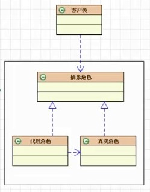
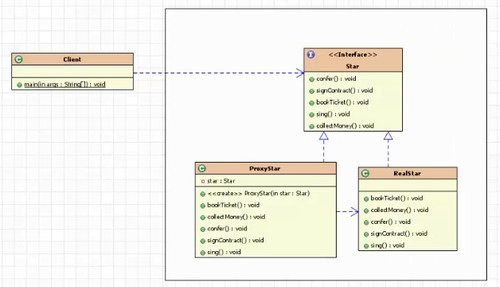

## 模式介绍

代理模式：为其他对象提供一种代理以便控制对这个对象的访问。

可以详细控制访问某个类（对象）的方法，在调用这个方法前作的前置处理（统一的流程代码放到代理中处理）。调用这个方法后做后置处理。

例如：明星的经纪人，租房的中介等等都是代理

代理模式分类：

- 静态代理（静态定义代理类，我们自己静态定义的代理类。比如我们自己定义一个明星的经纪人类）
- 动态代理（通过程序动态生成代理类，该代理类不是我们自己定义的。而是由程序自动生成）比较重要！！
    - JDK自带的动态代理
    - javaassist字节码操作库实现
    - CGLIB
    - ASM（底层使用指令，可维护性较差）

静态代理模式结构图：



**静态代理模式一般会有三个角色：**

1. 抽象角色：指代理角色（经纪人）和真实角色（明星）对外提供的公共方法，一般为一个接口
2. 真实角色：需要实现抽象角色接口，定义了真实角色所要实现的业务逻辑，以便供代理角色调用。也就是真正的业务逻辑在此。
3. 代理角色：需要实现抽象角色接口，是真实角色的代理，通过真实角色的业务逻辑方法来实现抽象方法，并可以附加自己的操作。将统一的流程控制都放到代理角色中处理！

## 实例代码

### 静态代理模式

这里定义一个抽象角色接口（Star）、代理角色实现（ProxyStar）、真实角色实现（RealStar）

抽象角色接口：提供了与明星合作的一系列流程

```java
package com.fz.proxy.staticProxy;

/**
 * 抽象角色：提供代理角色和真实角色对外提供的公共方法
 */
public interface Star {
    void confer();//面谈

    void signContract();//签合同

    void bookTicket();//订票

    void sing();//唱歌

    void collectMoney();//收尾款
}
```

代理角色实现类：代理角色中代理了真实角色所需要的操作（唱歌）

```java
package com.fz.proxy.staticProxy;

/**
 * 代理角色（明星经纪人）：
 */
public class ProxyStar implements Star {
    private Star star;//真实对象的引用（明星）

    @Override
    public void confer() {
        System.out.println("ProxyStar.confer()");
    }

    @Override
    public void signContract() {
        System.out.println("ProxyStar.signContract()");
    }

    @Override
    public void bookTicket() {
        System.out.println("ProxyStar.bookTicket()");
    }

    @Override
    public void sing() {
        star.sing();//真实对象的操作（明星唱歌）
    }

    @Override
    public void collectMoney() {
        System.out.println("ProxyStar.collectMoney()");
    }

    public ProxyStar(Star star) {//通过构造器给真实角色赋值
        this.star = star;
    }
}
```

真实角色实现类：这里的真实角色中其实只做了一个唱歌的操作，这是真实角色真正的业务逻辑部分

```java
package com.fz.proxy.staticProxy;

/**
 * 真实角色（明星艺人）：
 */
public class RealStar implements Star {
    @Override
    public void confer() {
        System.out.println("RealStar.confer()");
    }

    @Override
    public void signContract() {
        System.out.println("RealStar.signContract()");
    }

    @Override
    public void bookTicket() {
        System.out.println("RealStar.bookTicket()");
    }

    @Override
    public void sing() {
        System.out.println("张学友.sing()");//真实角色的操作：真正的业务逻辑
    }

    @Override
    public void collectMoney() {
        System.out.println("RealStar.collectMoney()");
    }
}
```

测试代理类：

```java
public static void main(String[]args){
        Star real=new RealStar();
        Star proxy=new ProxyStar(real);
        proxy.confer();
        proxy.signContract();
        proxy.bookTicket();
        proxy.sing();//真实对象的操作（明星唱歌）
        proxy.collectMoney();
        }
```

输出结果为：

```text
ProxyStar.confer()
ProxyStar.signContract()
ProxyStar.bookTicket()
张学友.sing()     //这里是真实角色的业务逻辑处理
ProxyStar.collectMoney()
```

以上代码UML图如下：



### 动态代理模式

动态代理是不需要定义代理角色的，通过一个处理器来处理代理角色的业务逻辑。

抽象角色接口：提供了与明星合作的一系列流程

```java
package com.fz.proxy.staticProxy;

/**
 * 抽象角色：提供代理角色和真实角色对外提供的公共方法
 */
public interface Star {
    void confer();//面谈

    void signContract();//签合同

    void bookTicket();//订票

    void sing();//唱歌

    void collectMoney();//收尾款
}
```

真实角色实现类：这里的真实角色中其实只做了一个唱歌的操作，这是真实角色真正的业务逻辑部分

```java
package com.fz.proxy.staticProxy;

/**
 * 真实角色（明星艺人）：
 */
public class RealStar implements Star {
    @Override
    public void confer() {
        System.out.println("RealStar.confer()");
    }

    @Override
    public void signContract() {
        System.out.println("RealStar.signContract()");
    }

    @Override
    public void bookTicket() {
        System.out.println("RealStar.bookTicket()");
    }

    @Override
    public void sing() {
        System.out.println("张学友.sing()");//真实角色的操作：真正的业务逻辑
    }

    @Override
    public void collectMoney() {
        System.out.println("RealStar.collectMoney()");
    }
}
```

代理角色的处理器：

```java
package com.fz.proxy.dynamicProxy;

import java.lang.reflect.InvocationHandler;
import java.lang.reflect.Method;

/**
 * 处理器
 */
public class StarHandler implements InvocationHandler {
    private Star realStar;//真实角色

    /**
     * 所有的流程控制都在invoke方法中
     * proxy：代理类
     * method：正在调用的方法
     * args：方法的参数
     */
    @Override
    public Object invoke(Object proxy, Method method, Object[] args) throws Throwable {
        Object object = null;
        System.out.println("真实角色调用之前的处理.....");
        if (method.getName().equals("sing")) {
            object = method.invoke(realStar, args);//激活调用的方法   
        }
        System.out.println("真实角色调用之后的处理.....");
        return object;
    }

    //通过构造器来初始化真实角色
    public StarHandler(Star realStar) {
        super();
        this.realStar = realStar;
    }
}
```

测试代理模式：

```java
public static void main(String[]args){
        //真实角色
        Star realStar=new RealStar();
        //处理器
        StarHandler handler=new StarHandler(realStar);
        //代理类
        Star proxy=(Star)Proxy.newProxyInstance(ClassLoader.getSystemClassLoader(),new Class[]{Star.class},handler);
        proxy.sing();//调用代理类的唱歌方法：其实调用的是真实角色的唱歌方法
        }
```
