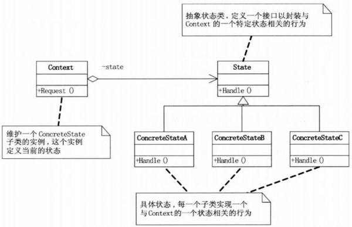

## 模式介绍

状态模式：当一个对象的内在状态改变时允许改变其行为，这个对象看起来像是改变了其类

状态模式主要解决的是当控制一个对象状态转换的条件表达式过于复杂时的情况。

把状态的判断逻辑转移到表示不同状态的一系列类当中，可以把复杂的判断逻辑简化。

当遇到不同的状态遇到不同的行为的时候，可以使用状态模式

状态模式UML图


**State（抽象状态类）**：定义一个接口以封装与Context的一个特定状态相关的行为。

**ConcreteStateA，B，C（具体状态）**：每一个子类实现一个不同的状态或行为

**Context（上下文）**：维护一个State子类状态的实例，这个实例中定义了当前的状态。

## 实例代码

首先按照UML图中，定义一个State接口，使用抽象类也行

```java
//抽象状态类
public interface State {
    void handler();
}
```

然后定义几个具体的状态

```java
//具体状态：空闲
public class FreeState implements State {
    @Override
    public void handler() {
        System.out.println("房间空闲中，可以预定！");
    }
}

//具体状态：已预定
public class BookedState implements State {
    @Override
    public void handler() {
        System.out.println("房间已被预定！");
    }
}

//具体状态：已入住
public class CheckedInState implements State {
    @Override
    public void handler() {
        System.out.println("房间已入住！");
    }
}
```

开始定义重要的部分，Context上下文。这个对象中定义了当前状态

```java
//上下文对象：用来引用一个State的实例，维护各个状态
public class Context {
    private State state;//当前状态

    public void request(State s) {
        System.out.print("修改状态：");
        this.state = s;
        state.handler();
    }
}
```

测试代码：

```java
public static void main(String[]args){
        Context context=new Context();
        context.request(new FreeState());//空闲状态
        context.request(new BookedState());//预定状态
        context.request(new CheckedInState());//已入住
        }
```

结果：

```text
修改状态：房间空闲中，可以预定！
修改状态：房间已被预定！
修改状态：房间已入住！
```

在上面的例子中，如果不用状态模式，想要改变房间状态的话。则需要大量条件分支判断

```java
if("空闲".equals(home.state)){
        System.out.println("空闲状态");
        }else if("已预定".equals(home.state)){
        System.out.println("已预订");
        }else if("已入住".equals(home.state)){
        System.out.println("已入住");
        }
```

## 总结

### 常见应用场景

1. 银行系统中账号状态的管理
2. OA系统中公文状态的管理
3. 酒店系统中，房间状态的管理
4. 线程对象各状态之间的切换

### 状态模式的好处：

1. 可以将不同状态的不同行为分割开来，将相关的行为进行局部化。以便更改局部状态
2. 消除了庞大的条件分支语句。

### 什么时候使用状态模式呢？

当一个对象的行为取决于它的状态，并且它必须在运行时刻根据状态改变它的行为时，就可以考虑使用状态模式了。
