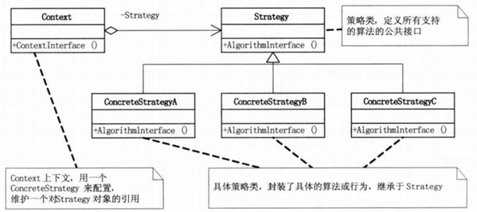

## 模式介绍

策略模式：它定义了算法家族，分别封装起来，让它们之间可以互相替换，此模式让算法的变化不会影响到使用算法的客户。

例如：

商场中的收银软件，内部是怎么针对不同的商品打不同的折扣呢？又或者，是怎么根据不同会员等级打不同的折扣呢？

其实内部就是定义了一个算法家族，给每个会员或者商品都指定一个特定的算法，根据不同的算法，打不同的折扣。

策略模式UML图：


Strategy（抽象算法接口）：定义了所有支持算法的公共接口

ConcreteStrategyA、ConcreteStrategyB和ConcreteStrategyC：继承于Strategy，封装了具体的算法

Context（上下文）：用来维护不同对象的不同算法实现

## 实例代码

这里以不同的用户买商品打折为例

首先定义一个抽象算法接口：

```java
//抽象算法接口：定义了所有支持算法的公共接口
public interface Strategy {
    //算法方法:打印商品的价格（不同的实现打不同的折扣）
    public double getPrice(double price);
}
```

然后定义具体的各个算法

```java
//具体的算法:普通用户，不打折
public class GeneralUser implements Strategy {
    @Override
    public double getPrice(double price) {
        System.out.println("普通用户，不打折");
        return price;
    }
}

//具体的算法:注册用户：打9折
public class RegisterUser implements Strategy {
    @Override
    public double getPrice(double price) {
        System.out.println("注册用户：打9折");
        return price * 0.9;
    }
}

//具体的算法：普通会员：打8折
public class RegisterVip implements Strategy {
    @Override
    public double getPrice(double price) {
        System.out.println("普通会员：打8折");
        return price * 0.8;
    }
}

//具体的算法：老会员：打5折
public class OldVip implements Strategy {
    @Override
    public double getPrice(double price) {
        System.out.println("老会员：打5折");
        return price * 0.5;
    }
}
```

接下来开始定义一个上下文，用来维护不同用户不同的折扣。

```java
//上下文：用来维护不同对象的不同折扣
public class Context {
    private Strategy strategy;//持有算法族的引用

    public Context(Strategy strategy) {
        super();
        this.strategy = strategy;
    }

    //打印价钱
    public void printPrice(double price) {
        System.out.println("应付金额：" + Math.round(strategy.getPrice(price)));
    }
}
```

客户端测试代码：

```java
public static void main(String[]args){
        double price=998;//商品价格
        Strategy generalUser=new GeneralUser();//普通用户
        Strategy registerUser=new RegisterUser();//注册用户
        Strategy registerVip=new RegisterVip();//普通会员
        Strategy oldVip=new OldVip();//老会员

        //根据不同的用户打不同的折扣
        Context c1=new Context(generalUser);
        c1.printPrice(price);
        Context c2=new Context(registerUser);
        c2.printPrice(price);
        Context c3=new Context(registerVip);
        c3.printPrice(price);
        Context c4=new Context(oldVip);
        c4.printPrice(price);
        }
```

打印结果如下：

```text
普通用户，不打折
应付金额：998
注册用户：打9折
应付金额：898
普通会员：打8折
应付金额：798
老会员：打5折
应付金额：499
```

## 总结

### 常见应用场景

策略模式本质：分离算法，选择不同的实现。

应用场景：

- JAVASE的布局管理
- Spring框架中，Resource接口，资源访问策略
- javax.servlet.http.HttpServlet#service();
