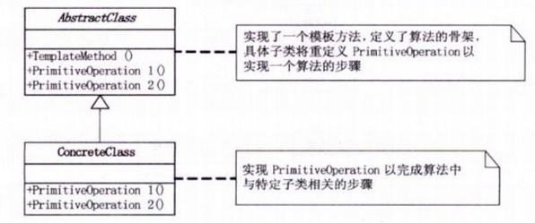

## 模式介绍

模板方法模式：定义一个操作中的算法骨架，而将一些步骤延迟到子类中。模板方法使得子类可以不改变一个算法的结构即可重定义该算法的

某些特定步骤。

核心：处理某个流程的代码已经都具备，但是其中某个节点的代码暂时不能确定。因此，我们采用工厂方法模式，将这个节点的代码实现转移给

子类完成。即：处理步骤在父类中定义好，具体的实现延迟到子类中定义。

说白了，就是将一些相同操作的代码，封装成一个算法的骨架。核心的部分留在子类中操作，在父类中只把那些骨架做好。

例如：

1.去银行办业务，银行给我们提供了一个模板就是：先取号，排对，办理业务（核心部分我们子类完成），给客服人员评分，完毕。

这里办理业务是属于子类来完成的，其他的取号，排队，评分则是一个模板。

2.去餐厅吃饭，餐厅给提供的一套模板就是：先点餐，等待，吃饭（核心部分我们子类完成），买单

这里吃饭是属于子类来完成的，其他的点餐，买单则是餐厅提供给我们客户的一个模板。

模板方法UML图：


## 实例代码

这里使用银行办理业务为例

首先，定义一个模板。模板中把办理业务用作核心部分，让子类来实现。

```java
//模板抽象方法
public abstract class BankTemplateMethod {
    //模板方法中其他业务逻辑
    //1.取号排队
    public void takeNumber() {
        System.out.println("取号排队");
    }

    //2.办理具体的业务：这里留给子类来实现！！！
    public abstract void transact();

    //3.给客服评分
    public void evaluate() {
        System.out.println("反馈评分");
    }

    //模板方法
    public final void process() {
        this.takeNumber();
        this.transact();//这里则是具体的模板方法函数
        this.evaluate();
    }
}
```

然后定义具体的模板方法的子类

```java
//子类实现模板方法：取款
public class DrawMoney extends BankTemplateMethod {
    @Override
    public void transact() {
        System.out.println("我要取款");
    }
}
```

客户端测试

```java
//定义子类方式实现模板方法
BankTemplateMethod template=new DrawMoney();
        template.process();
```

打印结果：

```text
取号排队
我要取款
反馈评分
```

当然，也可以使用一个匿名内部类的方式来实现这种模板方法。

```java
BankTemplateMethod template1=new BankTemplateMethod(){
    //这里使用匿名内部类实现:只需实现具体业务部分，其他部分则使用模板方法定义好的骨架
    @Override
    public void transact(){
        System.out.println("我要存钱");
    }
};
template1.process();
```

打印结果也是一样：

```text
取号排队
我要取款
反馈评分
```

## 总结

什么时候用模板方法模式？

> 实现一些操作时，整体步骤很固定，但是呢。就是其中一小部分容易变，这时候可以使用模板方法模式，将容易变的部分抽象出来，供子类实现。

### 常见应用场景

- 其实，各个框架中，都有模板方法模式的影子。
- 数据库访问的封装
- Junit单元测试
- servlet中关于doGet/doPost方法的调用
- Hibernate中模板程序
- spring中JDBCTemplate，HibernateTemplate等等
